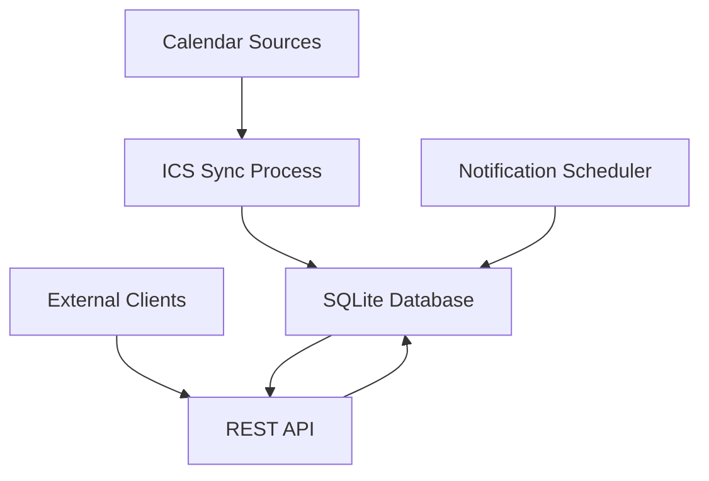

# ICS-Gate Architecture Summary

## Overview

ICS-Gate is a service that processes ICS calendars and notifies external clients about upcoming events. The service provides a REST API for clients to retrieve pending notifications and confirm delivery.

## Key Components

### 1. REST API
- Flask-based web API with API key authentication
- Endpoints for retrieving pending events and confirming delivery
- Health check endpoint for monitoring

### 2. ICS Synchronization
- Background process that periodically downloads and parses ICS calendars
- Stores events in SQLite database with DESCRIPTION and LOCATION fields
- Detects changes using content hashing

### 3. Notification Scheduler
- Background process that identifies upcoming events
- Marks events as pending notification based on configurable time window
- Prevents duplicate notifications

### 4. SQLite Database
- Persistent storage for users, calendars, and events
- Indexes for optimized query performance
- Foreign key relationships between entities

## Data Flow



## Configuration

### Configuration File (config.yml)
```yaml
api_key: "your-secret-api-key"
SYNC_INTERVAL_MINUTES: 15
NOTIFY_INTERVAL_SECONDS: 60
DB_PATH: "/data/icsgate.db"
TIMEZONE_DEFAULT: "UTC"

calendars:
  "user1": "https://calendar.google.com/calendar/ical/..."
```

### Environment Variables
- `ICS_GATE_API_KEY`: API key for authentication
- `SYNC_INTERVAL_MINUTES`: ICS synchronization frequency
- `NOTIFY_INTERVAL_SECONDS`: Notification check frequency
- `DB_PATH`: Path to SQLite database
- `CONFIG_PATH`: Path to YAML configuration file
- `TIMEZONE_DEFAULT`: Default timezone

## Security

- API key authentication for all protected endpoints
- Rate limiting to prevent abuse
- Input validation and sanitization
- Secure configuration management

## Deployment

- Docker container with persistent volume for database
- Health checks for monitoring
- Configurable through environment variables
- Single-port HTTP interface

## Monitoring

- Comprehensive logging for all operations
- Health check endpoint
- Error tracking and reporting
- Performance metrics collection

## Testing

- Unit tests for individual components
- Integration tests for complete workflows
- API tests for all endpoints
- Performance and load testing