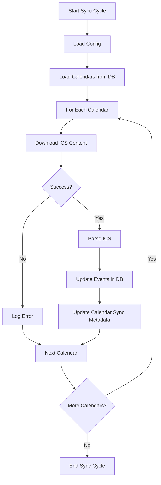
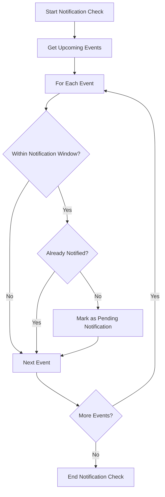

# Background Processes Specification

## Overview

ICS-Gate requires two background processes:
1. ICS Synchronization - Periodically downloads and parses ICS calendars
2. Notification Scheduler - Determines which events need notifications

## ICS Synchronization Process

### Purpose
Download and parse ICS calendars to keep event data up-to-date.

### Configuration
- `SYNC_INTERVAL_MINUTES`: How often to run synchronization (default: 15)
- `CONFIG_PATH`: Path to YAML configuration file

### Workflow

### Implementation Details
- Run as a separate thread or process
- Use scheduler to run at configured intervals
- Handle HTTP errors gracefully
- Log sync results for monitoring

## Notification Scheduler Process

### Purpose
Identify events that are approaching and need notifications sent.

### Configuration
- `NOTIFY_INTERVAL_SECONDS`: How often to check for notifications (default: 60)
- `NOTIFY_BEFORE_MINUTES`: How far in advance to notify (default: 10)

### Workflow

### Implementation Details
- Run as a separate thread or process
- Use scheduler to run at configured intervals
- Calculate notification window based on event start time
- Update event status in database

## Process Management

### Startup
- Start both background processes when application starts
- Validate configuration before starting processes
- Log process startup

### Shutdown
- Gracefully stop background processes on application shutdown
- Wait for current operations to complete
- Log process shutdown

### Error Handling
- Log errors but continue running
- Implement circuit breaker for persistent failures
- Alert on critical failures

### Monitoring
- Log process execution times
- Track number of items processed
- Monitor for stuck processes

## Concurrency Considerations

### Thread Safety
- Use thread-safe database connections
- Avoid shared state between processes
- Use locks when necessary

### Resource Management
- Limit concurrent HTTP requests
- Manage database connection pool
- Monitor memory usage

## Configuration Validation

### On Startup
- Validate all configuration values
- Check that config file exists and is readable
- Validate database connectivity

### Runtime
- Handle configuration changes gracefully
- Log configuration at startup
- Use default values for missing configuration

## Health Monitoring

### Process Health
- Track last successful execution time
- Monitor for hung processes
- Log process status periodically

### Metrics
- Number of calendars processed
- Number of events updated
- Number of notifications scheduled
- Error rates
- Execution times

## Recovery

### Failure Recovery
- Continue processing other calendars if one fails
- Retry failed operations with exponential backoff
- Alert on persistent failures

### Data Consistency
- Use database transactions for consistency
- Handle partial failures gracefully
- Log data inconsistencies for manual resolution