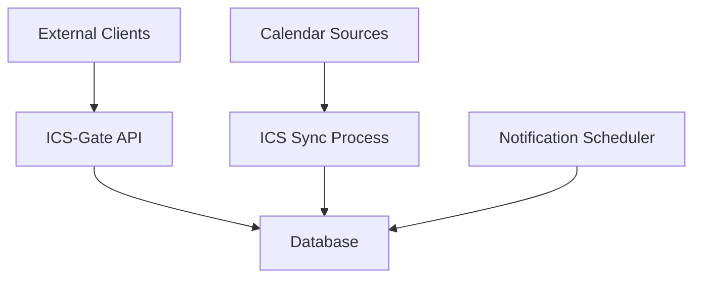

# Documentation Specification

## Overview

This document outlines the documentation requirements for ICS-Gate, including API documentation, user guides, and technical documentation.

## Documentation Structure

### README.md
Primary project documentation including:
- Project overview and features
- Quick start guide
- Configuration instructions
- API usage examples
- Development setup
- Contributing guidelines

### API Documentation
Detailed API reference including:
- Endpoint specifications
- Request/response examples
- Authentication details
- Error codes
- Rate limiting

### Technical Documentation
In-depth technical information including:
- Architecture overview
- Database schema
- Component interactions
- Background processes
- Deployment guide

### Configuration Guide
Detailed configuration instructions including:
- Environment variables
- Configuration file format
- Security best practices
- Performance tuning

## README.md Content

### Project Header
```markdown
# ICS-Gate

A service for processing ICS calendars and notifying external clients about upcoming events.

[]
[]
```

### Features
- ICS calendar parsing and storage
- REST API with API key authentication
- Background synchronization and notification scheduling
- SQLite persistence
- Docker deployment

### Quick Start
```bash
# Clone repository
git clone https://github.com/.../ics-gate.git
cd ics-gate

# Create configuration
cp config.example.yml config.yml
# Edit config.yml with your settings

# Run with Docker
docker-compose up -d
```

### Configuration
```yaml
api_key: "your-secret-api-key"
SYNC_INTERVAL_MINUTES: 15
NOTIFY_INTERVAL_SECONDS: 60

calendars:
  "user1": "https://calendar.google.com/calendar/ical/..."
```

### API Usage
```bash
# Get pending events
curl -H "X-API-Key: your-api-key" http://localhost:5800/events/pending

# Mark notification as delivered
curl -X POST -H "X-API-Key: your-api-key" \
  -H "Content-Type: application/json" \
  -d '{"delivered_at": "2023-06-15T09:30:00Z"}' \
  http://localhost:5800/notifications/123/delivered
```

## API Documentation

### OpenAPI Specification
Generate OpenAPI 3.0 specification for the API:

```yaml
openapi: 3.0.0
info:
  title: ICS-Gate API
  version: 1.0.0
  description: API for processing ICS calendars and managing event notifications

servers:
  - url: http://localhost:5800
    description: Local development server

components:
  securitySchemes:
    ApiKeyAuth:
      type: apiKey
      in: header
      name: X-API-Key

security:
  - ApiKeyAuth: []

paths:
  /events/pending:
    get:
      summary: Get pending events
      description: Retrieve events that are approaching and need notification
      responses:
        '200':
          description: Successful response
          content:
            application/json:
              schema:
                type: object
                properties:
                  events:
                    type: array
                    items:
                      $ref: '#/components/schemas/Event'
```

### API Reference
Detailed documentation for each endpoint:

#### GET /events/pending
**Description**: Retrieves events that are approaching and need to be notified to clients.

**Authentication**: Required. API key in header or query parameter.

**Response**:
```json
{
  "events": [
    {
      "id": 123,
      "uid": "event-uid-123",
      "title": "Team Meeting",
      "description": "Weekly team meeting to discuss project progress",
      "location": "Conference Room 3",
      "start_datetime": "2023-06-15T10:00:00Z",
      "end_datetime": "2023-06-15T11:00:00Z",
      "all_day": false
    }
  ]
}
```

#### POST /notifications/{id}/delivered
**Description**: Confirms that a notification has been successfully delivered to the client.

**Authentication**: Required. API key in header or query parameter.

**Request Body**:
```json
{
  "delivered_at": "2023-06-15T09:30:00Z"
}
```

**Response**:
```json
{
  "status": "success",
  "message": "Notification marked as delivered",
  "event_id": 123
}
```

## Technical Documentation

### Architecture Overview


### Database Schema
Detailed documentation of database tables and relationships.

### Component Interactions
Documentation of how different components interact:
- API request flow
- Background process execution
- Database access patterns
- Error handling flows

### Background Processes
Documentation of:
- ICS synchronization process
- Notification scheduling process
- Process startup and shutdown
- Error handling and recovery

## Configuration Guide

### Environment Variables
Complete list of environment variables:
- `ICS_GATE_API_KEY`: API key for authentication
- `SYNC_INTERVAL_MINUTES`: ICS synchronization frequency
- `NOTIFY_INTERVAL_SECONDS`: Notification check frequency
- `DB_PATH`: Path to SQLite database
- `CONFIG_PATH`: Path to YAML configuration file
- `TIMEZONE_DEFAULT`: Default timezone

### Configuration File
Detailed explanation of config.yml format:
```yaml
api_key: "your-secret-api-key"
SYNC_INTERVAL_MINUTES: 15
NOTIFY_INTERVAL_SECONDS: 60
DB_PATH: "/data/icsgate.db"
TIMEZONE_DEFAULT: "UTC"

calendars:
  "user1": "https://calendar.google.com/calendar/ical/..."
  "user2": "https://outlook.office365.com/owa/calendar/..."
```

### Security Best Practices
- API key management
- Secure configuration storage
- Network security considerations
- Database security

### Performance Tuning
- Database optimization
- Synchronization interval tuning
- Memory usage optimization
- Monitoring and metrics

## Development Documentation

### Development Setup
- Prerequisites
- Virtual environment setup
- Database initialization
- Running tests

### Code Structure
- Project layout
- Module organization
- Coding standards
- Testing guidelines

### Contributing Guidelines
- Pull request process
- Code review guidelines
- Testing requirements
- Documentation updates

## Deployment Documentation

### Docker Deployment
- Docker image usage
- Docker Compose configuration
- Volume management
- Environment configuration

### Production Deployment
- System requirements
- Database backup procedures
- Monitoring setup
- Scaling considerations

### Maintenance
- Log management
- Database maintenance
- Updates and upgrades
- Troubleshooting guide

## Documentation Tools

### Generation
- Use Sphinx for technical documentation
- Use Swagger UI for API documentation
- Use Markdown for simple documentation

### Hosting
- GitHub Pages for public documentation
- Internal documentation portal for private projects
- PDF generation for offline access

### Maintenance
- Version documentation with code releases
- Update documentation with feature changes
- Review documentation regularly
- Gather feedback from users

## Documentation Standards

### Writing Style
- Clear and concise language
- Consistent terminology
- Proper grammar and spelling
- Appropriate technical level

### Formatting
- Consistent heading structure
- Proper code formatting
- Clear examples
- Appropriate use of diagrams

### Review Process
- Technical accuracy review
- Usability review
- Regular updates
- User feedback incorporation