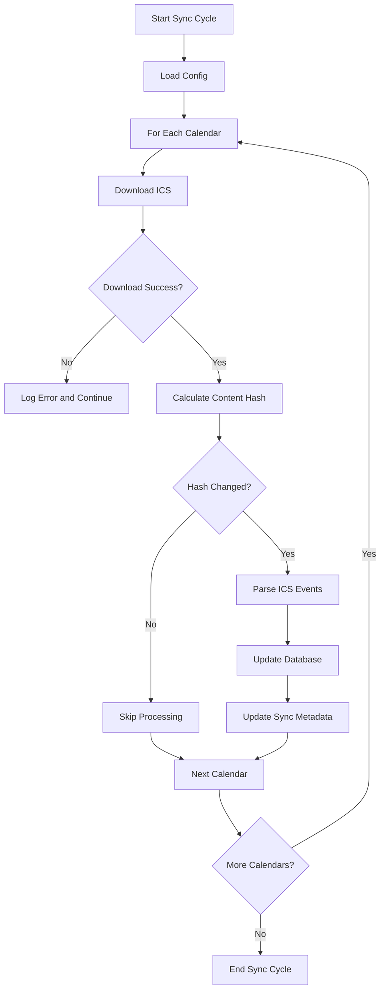

# ICS Synchronization Technical Specification

## Overview

The ICS synchronization component is responsible for:
1. Periodically loading calendar URLs from the configuration file
2. Downloading and parsing ICS files
3. Detecting new, updated, or deleted events
4. Updating the database with parsed events

## Components

### ICS Loader
Responsible for downloading ICS content from URLs.

**Functionality:**
- HTTP GET requests to calendar URLs
- Error handling for network issues, timeouts, invalid URLs
- Content validation to ensure it's a valid ICS file
- Support for HTTP headers if required by calendar providers

### ICS Parser
Parses ICS content and extracts events.

**Functionality:**
- Parse ICS format according to RFC 5545
- Extract event properties:
  - UID (unique identifier)
  - SUMMARY (title)
  - DESCRIPTION (description)
  - LOCATION (location)
  - DTSTART (start datetime)
  - DTEND (end datetime)
  - All-day event detection
- Handle recurring events (expand to individual instances)
- Handle timezones properly
- Validate event data

### Change Detection
Determines what has changed since the last sync.

**Functionality:**
- Calculate hash of ICS content for change detection
- Compare with previously stored hash
- If unchanged, skip processing
- If changed, process all events

### Database Updater
Updates the database with parsed events.

**Functionality:**
- Insert new events
- Update existing events (based on UID)
- Remove events that no longer exist in the ICS
- Update calendar's last_sync_at timestamp
- Update calendar's sync_hash

## Workflow



## Error Handling

### Network Errors
- Log connection timeouts, DNS failures, etc.
- Retry mechanism with exponential backoff
- Continue with other calendars if one fails

### Parsing Errors
- Log malformed ICS content
- Skip individual events with parsing errors
- Continue processing valid events

### Database Errors
- Log database connection/transaction errors
- Implement retry mechanism for transient errors
- Alert on persistent database issues

## Configuration

### Parameters
- `SYNC_INTERVAL_MINUTES`: How often to run synchronization
- `CONFIG_PATH`: Path to YAML configuration file
- `TIMEZONE_DEFAULT`: Default timezone for datetime handling

### Config File Format
```yaml
calendars:
  user1: https://example.com/calendar1.ics
  user2: https://example.com/calendar2.ics
```

## Performance Considerations

### Caching
- Cache parsed ICS content to avoid re-parsing
- Use ETags or Last-Modified headers for HTTP caching
- Implement in-memory cache for frequently accessed data

### Concurrency
- Process multiple calendars continuously 
- One by one in single thread

### Memory Usage
- Stream large ICS files instead of loading entirely into memory
- Process events in batches rather than all at once
- Clean up temporary data after processing

## Data Validation

### Input Validation
- Validate calendar URLs (proper format, scheme)
- Validate ICS content (proper format, required fields)
- Validate datetime formats

### Business Logic Validation
- Ensure event start time is before end time
- Validate timezone information
- Handle edge cases (all-day events, recurring events)

## Logging

### Sync Process
- Start and end of sync cycles
- Per-calendar processing status
- Summary of events added/updated/removed

### Errors
- Detailed error information for troubleshooting
- Context information (calendar URL, event UID)
- Error severity levels

## Monitoring

### Metrics
- Sync cycle duration
- Number of events processed
- Error rates
- HTTP response times

### Health Checks
- Database connectivity
- Calendar URL accessibility
- Recent sync status